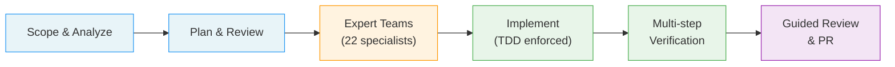

<div align="center">

# simon

**A 19-step autonomous coding pipeline for Claude Code —<br>22 experts, 5 domain teams, zero shortcuts.**

[](https://github.com/SW-in-beta/simon/stargazers)
[](LICENSE)
[](https://claude.com/claude-code)

[한국어](./README.md)

</div>

---

## Why simon?

Most AI coding assistants generate code and hope for the best. simon treats every task like a production deployment:

- **Ship with confidence** — A 19-step pipeline with mandatory TDD, 5 expert-team reviews, and a success-criteria gate means code is verified before you ever see a PR.
- **Scale without chaos** — Each work unit runs in an isolated git worktree. Parallel execution, zero interference, clean history.
- **Get smarter over time** — Built-in retrospectives feed back into future runs. A dedicated boost skill lets you teach it new tricks from articles, repos, and papers.
- **Stay safe by default** — No force pushes, no real DB access, no destructive commands. Ever.
- **Never lose your place** — State-Driven Execution restores the exact step position from workflow-state.json on every turn, surviving compaction and session resumption.
- **Self-correcting against rationalization** — Anti-Rationalization Tables and Red Flags structurally detect shortcuts (skipped steps, arbitrary interpretation, unverified progress) before they cause rework.

## How It Works



## Agent Strategy

Reliability is the top priority -- token usage and cost are irrelevant compared to result accuracy.

| Pattern | When to use | Core principle |
|---------|------------|----------------|
| **Agent Team** (shared context) | Agents with different perspectives discuss toward a shared goal | Six Thinking Hats -- each agent argues from a distinct viewpoint to reach better conclusions |
| **SubAgent** (isolated context) | Independent analyses converge to increase confidence | Monte Carlo -- convergence of independent trials provides higher confidence than any single analysis |

**Decision rule**: "Would agents produce better results by seeing each other's output?"
- **YES** -- Agent Team (discussion value > independence loss) -- best for planning, design debates
- **NO** -- SubAgent (independence value > discussion absence) -- best for verification, audits, parallel execution

> In verification/audit steps, opinion exchange via Agent Team's messaging becomes a pathway for confirmation bias. Steps where verification is the goal use SubAgents to structurally guarantee independence.

---

## Quick Start

```bash
git clone https://github.com/SW-in-beta/simon.git
cd simon
./install.sh
```

Then in Claude Code:

```
/simon implement user authentication with JWT
```

## Skills

| Skill | What it does |
|-------|-------------|
| `/simon` | Full 19-step pipeline — plan, implement, verify, PR |
| `/simon-grind` | Same pipeline, maximum tenacity — 10x retries, auto-diagnosis, checkpoint policy, strategy pivots |
| `/simon-pm` | Project manager — PRD-driven planning, distributes tasks to simon instances |
| `/simon-code-review` | PR-based code review — Draft PR creation, inline review comments, CI Watch, feedback loop |
| `/simon-sessions` | List, resume, or clean up worktree-based work sessions |
| `/simon-report` | Analysis documents (RFC, status report) via expert discussion — no code changes. Integrates graphify knowledge graph for exploration scope optimization |
| `/simon-auto-boost` | Auto web search skill improvement — searches latest AI coding agent best practices and auto-improves skills |
| `/simon-boost` | Read external resources and improve simon's own skills |
| `/simon-boost-capture` | Background capture of skill improvements — record insights without interrupting workflow |
| `/simon-boost-review` | Review & apply accumulated improvement insights from boost-capture |
| `/simon-ci-fix` | Auto-fix CI failures — log analysis, error classification, code fix, push (up to 5 cycles) |
| `/simon-company` | Full-stack software company — multi-team collaboration from planning to deployment & ops |
| `/simon-presenter` | Live demo presenter — run apps with Playwright for interactive demonstrations |
| `/simon-md-reviewer` | Open a Markdown file in a browser HTML viewer and run an inline-comment review loop |
| `/simon-web-search` | Deep web research — question decomposition → multi-pass parallel search → source triangulation → confidence-rated structured report |

### Pick the Right Skill

| I want to... | Use |
|--------------|-----|
| Build a feature or fix a bug | `/simon` |
| Tackle something complex that can't fail | `/simon-grind` |
| Plan and build an entire app | `/simon-pm` |
| Build a large-scale full-stack service (multi-team) | `/simon-company` |
| Create a PR with inline code review | `/simon-code-review` |
| Resume or manage previous sessions | `/simon-sessions` |
| Get an RFC or analysis without changing code | `/simon-report` |
| Improve simon from an article or repo | `/simon-boost` |
| Auto-search latest trends and improve skills | `/simon-auto-boost` |
| Note a skill improvement without stopping work | `/simon-boost-capture` |
| Batch-review and apply accumulated improvements | `/simon-boost-review` |
| Auto-fix CI failures (PR checks failing) | `/simon-ci-fix` |
| Demo a finished app with live browser interaction | `/simon-presenter` |
| Review a Markdown file with inline browser comments | `/simon-md-reviewer` |
| Deep research a technical topic with a structured report | `/simon-web-search` |

<details>
<summary><strong>Expert Teams (5 domains, 22 specialists)</strong></summary>

Experts operate as **teams that discuss and reach consensus**, not individual reviewers.

| Team | Members | Activation | Focus |
|------|---------|------------|-------|
| **Safety** | appsec, auth, infrasec, stability | Always (appsec + stability) | Security boundaries, auth bypass, failure recovery |
| **Code Design** | convention, idiom, design-pattern, testability | Always (convention + idiom) | Repo conventions, idioms, design patterns, testability |
| **Data** | rdbms, cache, nosql | Auto-detect (min 2) | Data consistency, cache invalidation, cross-storage integrity |
| **Integration** | sync-api, async, external-integration, messaging | Auto-detect (min 2) | Sync/async boundaries, error propagation, failure isolation |
| **Ops** | infra, observability, performance, concurrency | Auto-detect (min 2) | Operational stability, observability, performance |

</details>

<details>
<summary><strong>Configuration (config.yaml)</strong></summary>

Adjust thresholds, loop limits, and expert behavior in `.claude/workflow/config.yaml`:

```yaml
model_policy: opus              # Model for all agents
language: ko                    # Report language

unit_limits:
  max_files: 5
  max_lines: 200

size_thresholds:
  function_lines: 50
  file_lines: 300

loop_limits:
  critic_planner: 3
  step4b_critical: 2
  step7b_recheck: 1
  step7_8: 2
  step6_executor: 3
  step16: 3

expert_panel:
  mode: agent-team
  discussion_rounds: 2
  require_consensus: true

test_env:
  check_before_test: true
  skip_on_missing: true
```

Customize expert review criteria in `.claude/workflow/prompts/*.md` (22 expert prompts).
Past feedback is stored in `.claude/memory/retrospective.md` and automatically referenced in future runs.

</details>

<details>
<summary><strong>simon-code-review</strong></summary>

Handles PR creation and code review after work is complete:

- **Draft PR creation** — auto-generates PR based on change analysis with Review Guide section
- **Blind-First 2-Pass review** — analyzes diff independently before consulting review-sequence.md to avoid anchoring bias. Independent severity assessment with `[SEVERITY-DISPUTED]` tagging when assessments diverge
- **Existing pattern scan** — proactively searches the codebase for existing alternatives to newly introduced patterns
- **Official docs verification** — fact-checks used APIs/patterns against official docs (context7 MCP, WebSearch) to pre-identify deprecated APIs and anti-patterns
- **Impact analysis pass** — identifies unchanged code that may be affected by changes (1-depth caller/consumer search)
- **Architecture Impact** — Review Summary includes architecture impact analysis covering dependency direction, module boundaries, extensibility, and data flow (STANDARD+ path)
- **Large PR handling** — 100+ file PRs classified as Core/Support/Generated, 80% focus on core files
- **CI Watch** — delegates CI monitoring + auto-fix to simon-ci-fix (error classification, diagnosis, fix, push — up to 5 cycles)
- **Comment Auto-Watch** — polls PR comments every minute, auto-applies new feedback
- **Expert-verified feedback loop** — spawns domain expert Agents to verify user comments before acting (AGREE/PARTIAL/COUNTER verdict with Self-Agreement Bias mitigation)
- **Interruption recovery protocol** — auto-resumes remaining workflow after push failures, API errors, etc. Prevents inline review omission
- **Feedback loop** — code fix → commit → inline review rewrite → CI re-check

In STANDALONE mode, 3 Agent Teams (architect, writer, impact-analyzer) run parallel analysis to self-generate the review-sequence.

</details>

<details>
<summary><strong>simon-company</strong></summary>

Builds large-scale full-stack services with multi-team collaboration (PM, Design, Frontend, Backend, QA, DBA, DevOps, ML):

- **Consultation mode** — structures vague ideas through a guided interview
- **Scope Guard** — auto-redirects small projects to simon-pm
- **Full lifecycle** — planning → design → development → QA → deployment → operations
- Explicit invocation only (`/simon-company`)

</details>

<details>
<summary><strong>simon-presenter</strong></summary>

Runs finished apps with a Playwright headed browser for interactive live demonstrations:

- User-story-based scenarios showcasing core features
- Real browser interaction for behavior verification
- Presentation mode for stakeholder demos

</details>

<details>
<summary><strong>Boost Family (auto-boost / boost / boost-capture / boost-review)</strong></summary>

**simon-auto-boost** — Automatically searches Claude Code docs, Hacker News, Medium, YouTube and more for the latest AI coding agent best practices. A 6-person expert panel analyzes findings, proposes improvements with user approval, then verifies against skill writing guidelines and runs smoke tests. Tracks last search timestamp to only process new content.

**simon-boost** — Reads external resources (blogs, GitHub, papers) and a 6-person expert panel proposes skill improvements. All proposals require explicit approval before application.

**simon-boost-capture** — Records skill improvement insights in the background during active work. Captures ideas without interrupting your workflow for later batch processing.

**simon-boost-review** — Reviews and applies accumulated insights from boost-capture. Batch-processes captured improvement proposals into actual skill changes.

</details>

<details>
<summary><strong>simon-web-search</strong></summary>

Deep research skill for technical topics. Goes beyond simple search:

- **Question decomposition** — breaks the main question into 3-8 sub-topics before searching
- **Multi-pass parallel search** — Round 1 broad search, Round 2 gap detection, Round 3+ focused verification (deep mode)
- **Source triangulation** — cross-validates claims across independent sources. Single-source claims are marked `[UNVERIFIED]`
- **Source chain verification** — tracks 2nd-hand citations back to primary sources (no "A says B said C" without verifying C)
- **Confidence ratings** — every factual claim tagged with source URL and HIGH/MEDIUM/LOW confidence
- **Depth modes** — quick (1 round, ~1-2 min), standard (2-3 rounds, ~3-5 min), deep (3-5 rounds, ~7-15 min)
- **Report viewer integration** — generates a structured Markdown report and optionally renders it as HTML

</details>

<details>
<summary><strong>simon-ci-fix</strong></summary>

Auto-fixes CI failures on PRs with specialized recovery strategies per error type:

- **Up to 5 fix cycles** — log analysis, error classification, code fix, push, re-check
- **Error-type routing** — different strategies for lint, test, build, type-check failures
- **Dual mode** — auto-invoked by simon-code-review's CI Watch, or run standalone
- **Smart diagnosis** — analyzes CI logs to identify root cause before attempting fixes

</details>

<details>
<summary><strong>Anti-Rationalization & Red Flags</strong></summary>

Two structural mechanisms that keep the workflow on track:

**Anti-Rationalization Tables** — Each Phase A/B step lists common rationalizations and why they fail.

| Rationalization | Reality |
|----------------|---------|
| "The spec is clear, skip Step 0" | Scope Challenge determines SMALL/STANDARD/LARGE. Skipping causes over-engineering or missed validation |
| "Simple implementation, write code first, tests later" | Code without tests becomes an instant CRITICAL issue at Step 7 Expert Review |
| "I've built something similar, don't need reuse review" | Duplicate implementations found at Step 10 require rework |

**Red Flags** — If you see these, the workflow is not executing correctly:

- 3+ Steps progressed without updating `workflow-state.json`
- Quietly modifying files not in the plan
- Logging "will write tests later"
- Skipping Step 6 Purpose Alignment as "obviously passing"
- Proceeding to next step after a CRITICAL expert finding
- **Spec conflicts with existing code — proceeding with arbitrary interpretation instead of Confusion Management**

**Confusion Management Protocol** — When spec, code, or requirements conflict, stop and explicitly name the confusion point with options before proceeding.

**Post-Implementation Simplicity Check** — After implementation, detect and remove unnecessary complexity (over-abstraction, unused design slack, code duplication).

</details>

<details>
<summary><strong>Safety Rules</strong></summary>

The following actions are **absolutely forbidden** at all times:

- `git push --force` — never, under any circumstances
- Merge to `main`/`master` — only PRs
- `rm -rf` — no destructive deletions
- Real DB access — `mysql`, `psql`, `redis-cli`, `mongosh`
- Real API calls — `curl`, `wget` to external endpoints
- Real server access — `ssh`, `scp`, `sftp`
- Secret commits — `.env`, credentials, API keys
- Tests with real external systems — mock/stub only

</details>

<details>
<summary><strong>Full Workflow Details (19 steps)</strong></summary>

### Phase A: Planning (Interactive)

| Step | What happens |
|------|-------------|
| **0** | Scope challenge — analyze existing code, determine minimum change, select review path (SMALL / STANDARD / LARGE) |
| **1-A** | Project analysis + Code Design Team pre-analysis (conventions, patterns, idioms) |
| **1-B** | Interview mode — break work into units, build plan |
| **2** | Critic-planner discussion (up to 3 rounds) |
| **3** | Meta-verification of critic's review |
| **4** | Over-engineering check (YAGNI/KISS) |
| **4-B** | All 5 expert teams review the plan, flag concerns |

### Phase B-E: Implementation & Verification (Autonomous)

Each unit runs in an isolated git worktree with mandatory TDD (RED -> GREEN -> REFACTOR).

| Step | What happens |
|------|-------------|
| **5** | Implementation with TDD |
| **6** | Purpose alignment review |
| **7-A** | 5 expert teams verify against real diff |
| **7-B** | Cross-check against Step 4-B concerns |
| **8** | Regression verification |
| **9** | File/function splitting |
| **10** | Integration/reuse review |
| **11** | Side effect check |
| **12** | Full change review |
| **13** | Dead code cleanup |
| **14** | Code quality assessment |
| **15** | Flow verification (backend/data/error/event) |
| **16** | MEDIUM issue resolution |
| **17** | Production readiness + success criteria gate |

### Finalization

| Step | What happens |
|------|-------------|
| **Integration** | Commit, resolve conflicts, build/test verification |
| **18** | Work report (before/after flows, trade-offs, risks) |
| **18-B** | Group changes into logical review units |
| **19** | Interactive guided review, success criteria verification, PR creation |

</details>

## Requirements

- [Claude Code](https://claude.com/claude-code) v2.0+
- Git

## License

MIT
