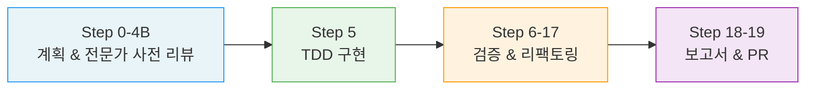

<div align="center">

# simon-bot

**Claude Code를 위한 19단계 심층 구현 엔진**

계획부터 PR까지, 22명의 전문가가 팀 토론으로 검증하는 자율 코딩 워크플로우

[](https://github.com/SW-in-beta/simon-bot)
[](LICENSE)
[](https://claude.com/claude-code)

[English](./README.en.md)

</div>

---

## 왜 simon-bot인가?

- **코드 품질을 타협하지 않습니다** — 19단계 파이프라인이 범위 검증부터 프로덕션 준비까지 모든 단계를 강제합니다
- **혼자 리뷰하지 않습니다** — 5개 도메인팀, 22명의 전문가가 팀 내 토론과 합의로 우려사항을 도출합니다
- **실패해도 포기하지 않습니다** — grind 모드는 자동 진단, 전략 전환, 체크포인트 롤백으로 끝까지 해결합니다
- **안전하게 격리됩니다** — 모든 작업은 독립 worktree에서 실행되고, TDD가 필수이며, 파괴적 명령은 차단됩니다
- **진행 상태를 잃지 않습니다** — State-Driven Execution으로 매 턴마다 workflow-state.json에서 정확한 Step 위치를 복원합니다

---

## 빠른 시작

```bash
git clone https://github.com/SW-in-beta/simon-bot
cd simon-bot
./install.sh
```

Claude Code에서 바로 사용하세요:

```
/simon-bot implement user authentication with JWT
```

---

## 동작 방식



**Phase A** — 기존 코드 분석, 인터뷰, 계획 수립, 전문가 팀 사전 리뷰 (대화형)<br>
**Phase B-E** — TDD 구현, 5개 팀 검증, 리팩토링, 회귀 테스트 (자율 실행)<br>
**마무리** — 인터랙티브 가이드 리뷰, 성공 기준 체크리스트 검증, PR 생성

---

## 스킬

| 스킬 | 설명 |
|------|------|
| `/simon-bot` | 19단계 심층 워크플로우 — 계획, 구현, 검증을 최고 수준의 엄밀함으로 수행 |
| `/simon-bot-grind` | 열일모드 — 재시도 한계 10, 자동 진단/복구/전략 전환 |
| `/simon-bot-pm` | 프로젝트 매니저 — PRD 기반 전체 앱 기획, simon-bot 인스턴스에 작업 분배 |
| `/simon-bot-review` | PR 기반 코드 리뷰 — Draft PR 생성, 인라인 리뷰 코멘트, CI Watch, 피드백 루프 |
| `/simon-bot-sessions` | 세션 관리 — worktree 기반 작업 세션 조회, 이어서 작업, 삭제 |
| `/simon-bot-report` | 사전 분석 보고서 — 전문가 팀 토론을 통한 RFC, 현황 분석, 커스텀 포맷 |
| `/simon-bot-auto-boost` | 자동 웹 검색 기반 스킬 개선 — 최신 AI 코딩 에이전트 best practices를 검색하여 스킬 자동 개선 |
| `/simon-bot-boost` | 외부 리소스 분석 — 링크를 읽고 스킬 개선을 제안 |
| `/simon-bot-boost-capture` | 작업 중 스킬 개선점 백그라운드 캡처 — 작업 흐름을 멈추지 않고 인사이트 기록 |
| `/simon-bot-boost-review` | 축적된 개선 인사이트 리뷰 & 적용 — 캡처된 개선안을 검토하고 스킬에 반영 |
| `/simon-bot-ci-fix` | CI 실패 자동 수정 — 로그 분석, 에러 분류, 코드 수정, 푸시를 최대 5 사이클 반복 |
| `/simon-company` | 풀스택 소프트웨어 회사 — 다중 전문 팀 협업으로 기획부터 배포·운영까지 완성 |
| `/simon-presenter` | 라이브 데모 프레젠터 — Playwright로 앱을 실제 구동하며 인터랙티브 시연 |

### 어떤 스킬을 쓸까?

| 상황 | 스킬 |
|------|------|
| 기능 구현 또는 버그 수정 | `/simon-bot` |
| 실패하면 안 되는 복잡한 코드베이스 | `/simon-bot-grind` |
| 전체 앱 빌드 또는 멀티 피처 프로젝트 | `/simon-bot-pm` |
| 대규모 풀스택 서비스 (다중 팀 협업) | `/simon-company` |
| 작업 완료 후 PR + 코드 리뷰 | `/simon-bot-review` |
| 이전 작업 세션 이어서 하기 | `/simon-bot-sessions` |
| RFC, 아키텍처 분석, 보고서 (코드 변경 없음) | `/simon-bot-report` |
| 유용한 아티클/레포 발견 — 스킬 개선 | `/simon-bot-boost` |
| 최신 트렌드 자동 검색 — 스킬 자동 개선 | `/simon-bot-auto-boost` |
| 작업 중 스킬 개선점 메모 (작업 흐름 유지) | `/simon-bot-boost-capture` |
| 축적된 개선안 일괄 검토 & 적용 | `/simon-bot-boost-review` |
| CI 실패 자동 수정 (PR checks 실패) | `/simon-bot-ci-fix` |
| 완성된 앱 라이브 데모 시연 | `/simon-presenter` |

---

<details>
<summary><strong>전문가 팀 구조 (5개 도메인팀, 22명)</strong></summary>
<br>

전문가들은 개별 리뷰가 아닌 **팀 내 토론**을 통해 합의 기반으로 우려사항을 도출합니다.

| 팀 | 멤버 | 활성화 | 토론 초점 |
|----|------|--------|----------|
| **Safety** | appsec, auth, infrasec, stability | 항상 (appsec+stability) | 보안 경계, 인증 우회, 장애 복구 |
| **Code Design** | convention, idiom, design-pattern, testability | 항상 (convention+idiom) | 레포 컨벤션, 언어 관용구, 설계 패턴, 테스트 가능성 |
| **Data** | rdbms, cache, nosql | auto-detect (min 2) | 데이터 일관성, 캐시 무효화, 스토리지 정합성 |
| **Integration** | sync-api, async, external-integration, messaging | auto-detect (min 2) | 동기/비동기 경계, 에러 전파, 장애 격리 |
| **Ops** | infra, observability, performance, concurrency | auto-detect (min 2) | 운영 안정성, 관측 가능성, 성능 |
</details>

<details>
<summary><strong>simon-bot-grind 상세</strong></summary>
<br>

simon-bot을 최대 집요함으로 확장합니다:

- 모든 재시도 한계 = 10 — 쉽게 포기하지 않습니다
- **에스컬레이션 래더** — 단순 수정 → 근본 원인 분석 → 전략 전환 → 최후의 수단
- **자동 진단** — 실패 추적, 패턴 감지, 전략 전환
- **체크포인트 정책** — 티어 경계(Attempt 3→4, 6→7) 자동 체크포인트, 진전 시 best 태그, 전략 전환 시 best로 롤백
- **진행 감지** — 2회 연속 정체 시 즉시 전략 전환
- **Cross-Step Compounding Failure 감지** — 동일 파일이 3개 이상 Step에서 반복 실패 시 기초 설계 결정 재검토
- **Architecture Sanity Check** — Step 8 이후 전체 diff의 아키텍처 일관성 1-pass 검증 (STANDARD+ 경로)
- **총 재시도 예산** — 전체 50회, 70% 도달 시 경고
- **레퍼런스 지연 로딩** — Startup/Phase 진입/에러 발생 시점에 필요한 파일만 로딩
- **신뢰도 점수** — 모든 에이전트 출력에 신뢰도 + 영향도 태깅
</details>

<details>
<summary><strong>simon-bot-pm 상세</strong></summary>
<br>

7단계 프로젝트 매니저 파이프라인:

| 단계 | 이름 | 역할 |
|------|------|------|
| 0 | Project Setup | 프로젝트 유형 감지, 실행 모드 선택 |
| 1 | Spec-Driven Design | 인터뷰 → Spec(WHAT) → Architecture(HOW) → PRD |
| 2 | Task Breakdown | PRD → 기능 분해 → 의존성 그래프 → 실행 계획 |
| 3 | Environment Setup | 스캐폴딩, 의존성, 설정 |
| 4 | Feature Execution | simon-bot/grind 인스턴스에 기능 분배 (가능한 경우 병렬) |
| 5 | Full Verification | 통합 테스트, 아키텍처 리뷰, 보안 리뷰 |
| 6 | Delivery | 최종 보고서, 가이드 리뷰, PR 생성 |

복잡도에 따라 `simon-bot` 또는 `simon-bot-grind`를 자동 할당합니다.
Phase 4 진입 시 PM은 Phase 1-3의 과정을 컨텍스트에서 제거하고 결과물만 로딩하여 컨텍스트 효율을 최적화합니다.
</details>

<details>
<summary><strong>simon-bot-review 상세</strong></summary>
<br>

작업 완료 후 PR 생성과 코드 리뷰를 수행합니다:

- **Draft PR 생성** — 변경사항 분석 기반 PR 자동 생성 + Review Guide 섹션 포함
- **Blind-First 2-Pass 리뷰** — review-sequence.md에 anchoring되지 않도록 diff만으로 먼저 분석 후 대조. 독립 severity 판정 후 구현자 판정과 불일치 시 `[SEVERITY-DISPUTED]` 태깅
- **기존 패턴 스캔** — diff에 도입된 새 패턴에 대해 코드베이스 내 기존 대안을 능동적으로 탐색
- **공식 문서 검증** — 사용된 API/패턴을 공식 문서(context7 MCP, WebSearch)로 fact-check하여 deprecated API, anti-pattern 사전 식별
- **영향 분석 Pass** — 변경되지 않았지만 영향받을 수 있는 코드를 1-depth 탐색하여 인라인 코멘트 작성
- **Architecture Impact** — Review Summary에 의존성 방향, 모듈 경계, 확장성, 데이터 흐름 관점의 아키텍처 영향 분석 포함 (STANDARD+ 경로)
- **대규모 PR 처리** — 100+ 파일 PR은 Core/Support/Generated로 분류, 핵심 파일에 80% 집중
- **CI Watch** — CI 모니터링 + 실패 자동 수정을 simon-bot-ci-fix에 위임 (에러 분류→진단→수정→푸시, 최대 5 cycles)
- **Comment Auto-Watch** — 1분 간격 PR 댓글 자동 감지, 새 피드백 즉시 반영
- **전문가 검증 피드백 루프** — 사용자 코멘트에 대해 도메인 전문가 Agent를 호출하여 검증 후 처리 (AGREE/PARTIAL/COUNTER verdict, Self-Agreement Bias 견제 포함)
- **중단 복구 프로토콜** — push 실패, API 오류 등으로 중단 시 잔여 워크플로를 자동 재개. 인라인 리뷰 누락 방지
- **피드백 루프** — 코드 수정 → 커밋 → 인라인 리뷰 재작성 → CI 재확인

STANDALONE 모드에서는 3개 Agent Team(architect, writer, impact-analyzer)이 병렬 분석하여 review-sequence를 자체 생성합니다.
</details>

<details>
<summary><strong>simon-company 상세</strong></summary>
<br>

대규모 풀스택 서비스를 다중 전문 팀(PM, Design, Frontend, Backend, QA, DBA, DevOps, ML)이 협업하여 완성합니다:

- **의뢰 모드** — 불명확한 아이디어를 구조화된 인터뷰로 구체화
- **Scope Guard** — 소규모 프로젝트는 simon-bot-pm으로 자동 리다이렉트
- **전체 라이프사이클** — 기획 → 디자인 → 개발 → QA → 배포 → 운영
- 명시적 호출 전용 (`/simon-company`)
</details>

<details>
<summary><strong>simon-presenter 상세</strong></summary>
<br>

완성된 앱을 Playwright headed 브라우저로 실제 구동하며 인터랙티브하게 시연합니다:

- 유저스토리 기반 시나리오로 앱의 핵심 기능 시연
- 실제 브라우저 조작으로 동작 검증
- 이해관계자에게 보여주기 위한 프레젠테이션 모드
</details>

<details>
<summary><strong>기타 스킬 상세 (report / boost 패밀리 / sessions)</strong></summary>
<br>

**simon-bot-report** — 코드 변경 없이 구현 전 분석 문서(RFC, 현황 분석, 커스텀 포맷)를 생성합니다. simon-bot과 동일한 5개 도메인 전문가 팀 토론 구조를 사용하며, 리뷰 후 simon-bot / simon-bot-pm으로 원활하게 핸드오프할 수 있습니다.

**simon-bot-auto-boost** — Claude Code 공식 문서, Hacker News, Medium, YouTube 등에서 최신 AI 코딩 에이전트 best practices를 자동 검색하고, 6인 전문가 패널 분석 → 사용자 승인 → 적용 → 스킬 가이드라인 검증 → 스모크 테스트까지 수행합니다. 마지막 검색 시점을 기록하여 이후 콘텐츠만 처리합니다.

**simon-bot-boost** — 외부 리소스(블로그, GitHub, 논문)를 읽고 6인 전문가 패널이 스킬 개선을 제안합니다. 모든 제안은 적용 전 명시적 승인이 필요하며 `.claude/boost/applied-log.md`에 기록됩니다.

**simon-bot-boost-capture** — 작업 중 발견한 스킬 개선점을 백그라운드로 분석·기록합니다. 작업 흐름을 멈추지 않고 인사이트를 캡처하여 나중에 일괄 처리할 수 있습니다.

**simon-bot-boost-review** — `simon-bot-boost-capture`로 축적된 개선 인사이트를 검토하고 실제 스킬에 반영합니다. 캡처된 개선안을 모아서 한번에 처리할 때 사용합니다.

**simon-bot-ci-fix** — PR의 CI 체크를 모니터링하고 실패 시 자동으로 수정합니다. 에러 유형별 전문 복구 전략으로 최대 5회 사이클(로그 분석→에러 분류→코드 수정→푸시→재확인)을 반복합니다. simon-bot-review의 CI Watch 단계에서 자동 호출되거나, 독립 실행도 가능합니다.

**simon-bot-sessions** — 여러 Claude Code 세션에 걸친 worktree 기반 작업을 관리합니다: `list` | `info <branch>` | `resume <branch>` | `delete <branch>` | `pr <branch>`
</details>

<details>
<summary><strong>설정 (config.yaml)</strong></summary>
<br>

```yaml
model_policy: opus                    # 전체 에이전트 모델
language: ko                          # 보고서 언어
unit_limits: { max_files: 5, max_lines: 200 }
size_thresholds: { function_lines: 50, file_lines: 300 }
loop_limits:
  critic_planner: 3                   # 계획 리뷰 반복
  step4b_critical: 2                  # 전문가 사전 리뷰 재시도
  step7_8: 2                          # 검증 루프
  step16: 3                           # MEDIUM 이슈 해결
expert_panel:
  mode: agent-team
  discussion_rounds: 2
  require_consensus: true
```

전문가 리뷰 기준은 `.claude/workflow/prompts/*.md`에서 수정 가능 (22개 전문가 프롬프트).
회고 피드백은 `.claude/memory/retrospective.md`에 저장되어 다음 실행 시 자동 참조됩니다.
</details>

<details>
<summary><strong>안전 규칙</strong></summary>
<br>

다음 작업은 **어떠한 경우에도 절대 금지**됩니다:

- `git push --force` — 어떤 상황에서도 사용 불가
- `main`/`master`에 직접 병합 — PR만 허용
- `rm -rf` — 파괴적 삭제 금지
- 실제 DB 접근 — `mysql`, `psql`, `redis-cli`, `mongosh`
- 실제 API 호출 — 외부 엔드포인트로의 `curl`, `wget`
- 실제 서버 접근 — `ssh`, `scp`, `sftp`
- 시크릿 커밋 — `.env`, 자격 증명, API 키
- 실제 외부 시스템을 사용한 테스트 — mock/stub만 허용
- simon-bot/grind에서 직접 `gh pr create` 실행 — simon-bot-review 스킬을 통해서만 PR 생성
</details>

---

## 요구 사항

- [Claude Code](https://claude.com/claude-code) v2.0+
- Git

## 라이선스

MIT
