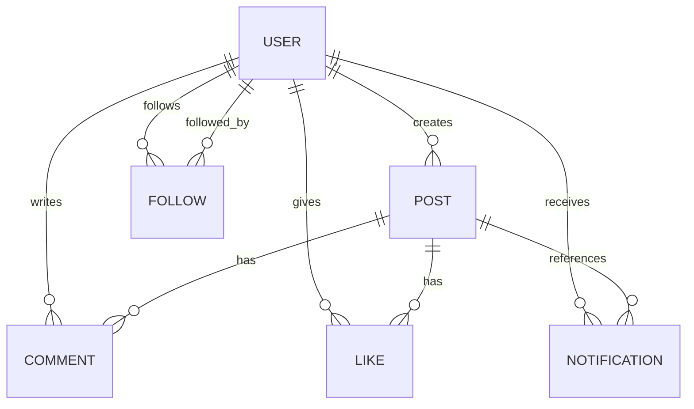

# DB Schema: InstaClone (SQLite)

## ER Diagram

## Tables

### users
| Column | Type | Constraints |
|--------|------|-------------|
| id | INTEGER | PRIMARY KEY AUTOINCREMENT |
| email | TEXT | UNIQUE NOT NULL |
| username | TEXT | UNIQUE NOT NULL |
| password_hash | TEXT | NOT NULL |
| bio | TEXT | DEFAULT '' |
| created_at | TEXT | DEFAULT CURRENT_TIMESTAMP |

### posts
| Column | Type | Constraints |
|--------|------|-------------|
| id | INTEGER | PRIMARY KEY AUTOINCREMENT |
| user_id | INTEGER | NOT NULL REFERENCES users(id) |
| image_url | TEXT | NOT NULL |
| caption | TEXT | DEFAULT '' |
| created_at | TEXT | DEFAULT CURRENT_TIMESTAMP |

### follows
| Column | Type | Constraints |
|--------|------|-------------|
| id | INTEGER | PRIMARY KEY AUTOINCREMENT |
| follower_id | INTEGER | NOT NULL REFERENCES users(id) |
| following_id | INTEGER | NOT NULL REFERENCES users(id) |
| created_at | TEXT | DEFAULT CURRENT_TIMESTAMP |
| | | UNIQUE(follower_id, following_id) |

### likes
| Column | Type | Constraints |
|--------|------|-------------|
| id | INTEGER | PRIMARY KEY AUTOINCREMENT |
| user_id | INTEGER | NOT NULL REFERENCES users(id) |
| post_id | INTEGER | NOT NULL REFERENCES posts(id) |
| created_at | TEXT | DEFAULT CURRENT_TIMESTAMP |
| | | UNIQUE(user_id, post_id) |

### comments
| Column | Type | Constraints |
|--------|------|-------------|
| id | INTEGER | PRIMARY KEY AUTOINCREMENT |
| user_id | INTEGER | NOT NULL REFERENCES users(id) |
| post_id | INTEGER | NOT NULL REFERENCES posts(id) |
| content | TEXT | NOT NULL |
| created_at | TEXT | DEFAULT CURRENT_TIMESTAMP |

### notifications
| Column | Type | Constraints |
|--------|------|-------------|
| id | INTEGER | PRIMARY KEY AUTOINCREMENT |
| user_id | INTEGER | NOT NULL REFERENCES users(id) |
| actor_id | INTEGER | NOT NULL REFERENCES users(id) |
| type | TEXT | NOT NULL CHECK(type IN ('like', 'comment', 'follow')) |
| post_id | INTEGER | REFERENCES posts(id) (nullable for follow) |
| read | INTEGER | DEFAULT 0 |
| created_at | TEXT | DEFAULT CURRENT_TIMESTAMP |

## Index Strategy
- users: email (UNIQUE), username (UNIQUE)
- posts: user_id, created_at DESC
- follows: (follower_id, following_id) UNIQUE, following_id
- likes: (user_id, post_id) UNIQUE, post_id
- comments: post_id, created_at
- notifications: user_id, created_at DESC, read

## Migration Strategy
- 단일 초기화 스크립트로 모든 테이블 생성 (SQLite 특성 활용)
- better-sqlite3의 동기 API 사용
- DB 파일: data/instaclone.db
