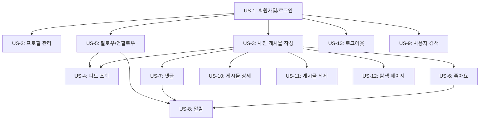

# Story Map: Picstory - 소셜 미디어 웹앱

## 사용자 여정 기반 기능 구조

```
Activity:   [가입/인증]              [콘텐츠 생산]          [콘텐츠 소비]           [소셜 연결]             [알림/관리]
               |                        |                     |                     |                      |
Tasks:     회원가입                  사진 게시물 작성       메인 피드 조회          팔로우/언팔로우         알림 확인
           로그인                    게시물 삭제            게시물 상세 보기        사용자 검색             프로필 관리
           로그아웃                                        탐색 페이지             좋아요
                                                                                  댓글
               |                        |                     |                     |                      |
Stories:   US-1 이메일 가입          US-3 사진+캡션        US-4 최신순 피드       US-5 팔로우 토글       US-8 알림 목록
(P1)       US-1 로그인                   게시물 작성        US-4 무한 스크롤       US-6 좋아요 토글       US-8 알림 배지
           US-13 로그아웃                                  US-4 빈 피드 안내      US-7 댓글 작성/삭제    US-2 프로필 수정
                                                                                                         US-2 프로필 사진
               |                        |                     |                     |                      |
Stories:                            US-11 게시물 삭제      US-10 게시물 상세      US-9 사용자 검색
(P2)                                                       US-10 전체 댓글 목록
               |                                              |
Stories:                                                  US-12 탐색 페이지
(P3)                                                      (인기 게시물 그리드)
```

## Walking Skeleton (Sprint 1 목표)

핵심 흐름의 최소 구현 - 각 Activity에서 최소 필수 Task를 수평으로 연결:

```
가입(이메일) -> 로그인 -> 사진 업로드 -> 피드 조회 -> 팔로우 -> 좋아요/댓글 -> 알림 확인
```

구체적으로:
1. **가입/인증**: 이메일/비밀번호 회원가입 + 로그인 + 로그아웃 (US-1, US-13)
2. **콘텐츠 생산**: 사진+캡션 게시물 작성 (US-3)
3. **콘텐츠 소비**: 최신순 피드 조회 + 무한 스크롤 (US-4)
4. **소셜 연결**: 팔로우/언팔로우 + 좋아요 + 댓글 (US-5, US-6, US-7)
5. **알림/관리**: 알림 목록 + 프로필 관리 (US-8, US-2)

## Release 계획

### Release 1 (Walking Skeleton - MVP)
P1 Stories 전체:
- US-1: 회원가입 및 로그인
- US-2: 프로필 관리
- US-3: 사진 게시물 작성
- US-4: 피드 조회
- US-5: 팔로우/언팔로우
- US-6: 좋아요
- US-7: 댓글
- US-8: 알림
- US-13: 로그아웃

### Release 2 (기능 강화)
P2 Stories:
- US-9: 사용자 검색
- US-10: 게시물 상세 페이지
- US-11: 게시물 삭제

### Release 3 (확장)
P3 Stories:
- US-12: 탐색 페이지

## 의존성 그래프


