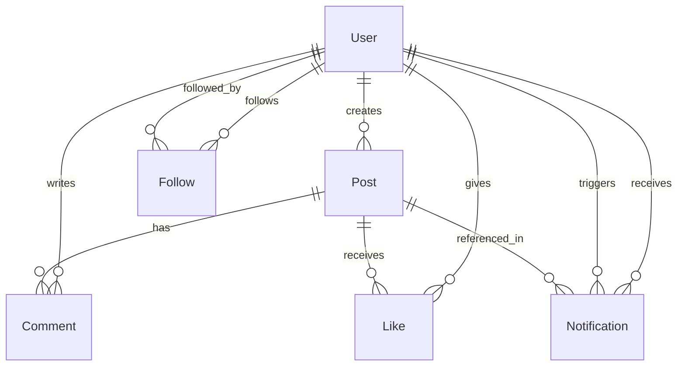

# DB Schema: Picstory

## ER Diagram

## Tables

### users
| Column | Type | Constraints |
|--------|------|-------------|
| id | TEXT (cuid) | PK |
| email | TEXT | UNIQUE, NOT NULL |
| username | TEXT | UNIQUE, NOT NULL |
| password_hash | TEXT | NOT NULL |
| display_name | TEXT | |
| bio | TEXT | |
| avatar_url | TEXT | |
| created_at | DATETIME | DEFAULT now |
| updated_at | DATETIME | DEFAULT now |

### posts
| Column | Type | Constraints |
|--------|------|-------------|
| id | TEXT (cuid) | PK |
| user_id | TEXT | FK → users.id, NOT NULL |
| image_url | TEXT | NOT NULL |
| caption | TEXT | |
| created_at | DATETIME | DEFAULT now |

### likes
| Column | Type | Constraints |
|--------|------|-------------|
| id | TEXT (cuid) | PK |
| user_id | TEXT | FK → users.id, NOT NULL |
| post_id | TEXT | FK → posts.id, NOT NULL |
| created_at | DATETIME | DEFAULT now |
| | | UNIQUE(user_id, post_id) |

### comments
| Column | Type | Constraints |
|--------|------|-------------|
| id | TEXT (cuid) | PK |
| user_id | TEXT | FK → users.id, NOT NULL |
| post_id | TEXT | FK → posts.id, NOT NULL |
| content | TEXT | NOT NULL |
| created_at | DATETIME | DEFAULT now |

### follows
| Column | Type | Constraints |
|--------|------|-------------|
| id | TEXT (cuid) | PK |
| follower_id | TEXT | FK → users.id, NOT NULL |
| following_id | TEXT | FK → users.id, NOT NULL |
| created_at | DATETIME | DEFAULT now |
| | | UNIQUE(follower_id, following_id) |

### notifications
| Column | Type | Constraints |
|--------|------|-------------|
| id | TEXT (cuid) | PK |
| user_id | TEXT | FK → users.id, NOT NULL (receiver) |
| actor_id | TEXT | FK → users.id, NOT NULL (trigger) |
| type | TEXT | NOT NULL (LIKE, COMMENT, FOLLOW) |
| post_id | TEXT | FK → posts.id (nullable — FOLLOW has no post) |
| read | BOOLEAN | DEFAULT false |
| created_at | DATETIME | DEFAULT now |

## Index Strategy
- users: email (unique), username (unique)
- posts: user_id + created_at DESC (프로필 게시물 조회)
- likes: user_id + post_id (unique, 중복 방지), post_id (좋아요 수 카운트)
- comments: post_id + created_at (댓글 목록)
- follows: follower_id + following_id (unique), following_id (팔로워 목록)
- notifications: user_id + created_at DESC (알림 목록), user_id + read (읽지 않은 알림 수)

## Migration Strategy
- Prisma 마이그레이션으로 관리
- 순서: users → posts → likes → comments → follows → notifications
- 시드: 테스트용 샘플 데이터
