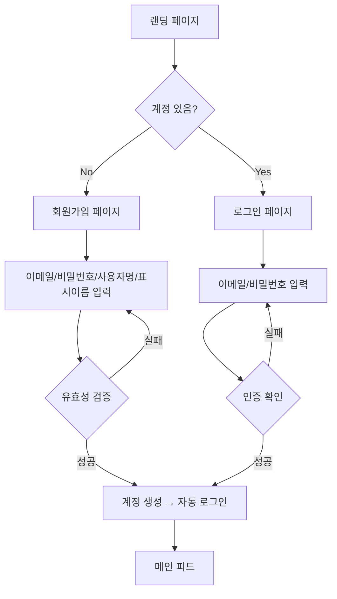
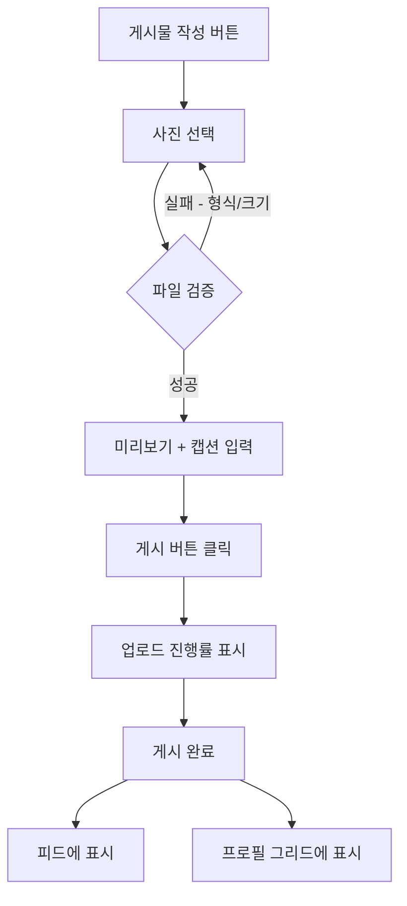
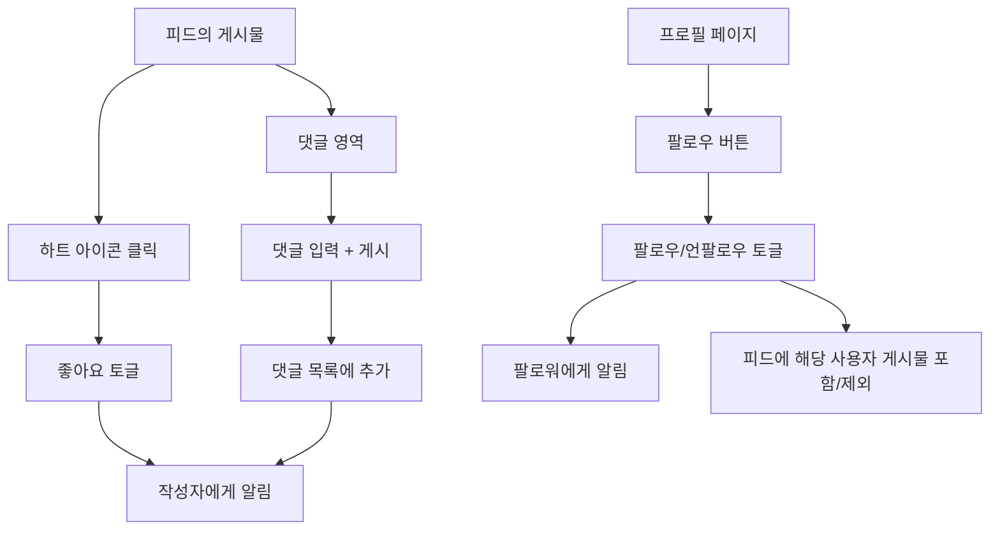
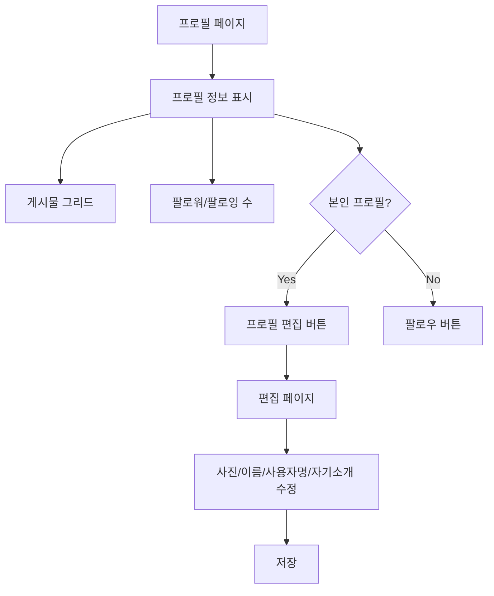
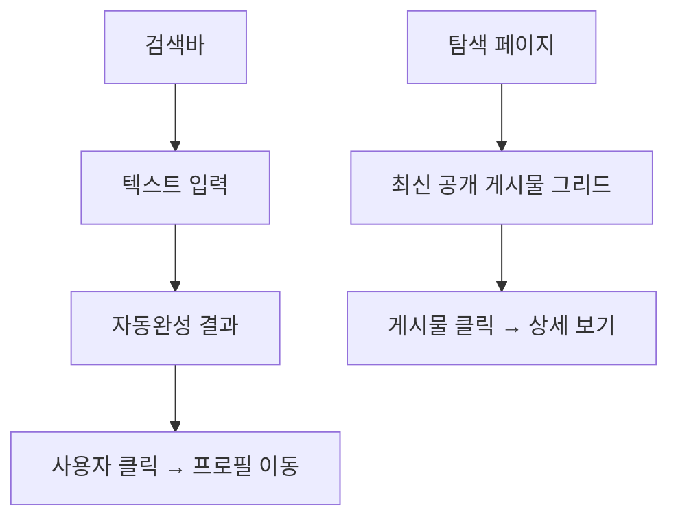

# Story Map: Picstory - 소셜 미디어 웹앱

## 사용자 여정 기반 Story Map

사용자의 핵심 여정을 기반으로 기능을 Activity -> Task -> Story로 계층화한다.

---

## Story Map 구조

```
Activity:   [가입/인증]           [콘텐츠 공유]          [소셜 활동]           [프로필/설정]         [발견]
              |                      |                    |                     |                   |
Tasks:      이메일 가입           사진 게시물 작성       팔로우/언팔로우        프로필 조회          사용자 검색
            로그인/로그아웃        피드 조회              좋아요                프로필 편집          탐색 페이지
                                   게시물 삭제           댓글
                                                         알림
              |                      |                    |                     |                   |
Stories     US-001 이메일가입      US-003 사진+캡션       US-005 팔로우         US-008 프로필조회    US-011 검색
(P1):       US-002 로그인/아웃     US-004 최신순피드      US-006 좋아요         US-009 프로필편집
                                                          US-007 댓글
                                                          US-010 알림
              |                      |                    |                     |                   |
Stories                            US-012 게시물삭제                                               US-013 탐색
(P2):

              |
Stories     US-014 소셜로그인
(P3):       US-016 비번재설정
                                   US-015 이미지필터
```

---

## Walking Skeleton (Sprint 1 목표)

핵심 흐름이 끝에서 끝까지 동작하는 최소 버전. 각 Activity의 최소 필수 Task를 수평으로 연결한다.

```
[이메일 가입] → [로그인] → [사진 게시물 작성] → [피드 조회] → [프로필 조회]
   US-001        US-002       US-003              US-004         US-008
```

**Walking Skeleton의 핵심:**
- 사용자가 계정을 만들고 (US-001)
- 로그인하고 (US-002)
- 사진을 올리고 (US-003)
- 피드에서 게시물을 보고 (US-004)
- 프로필에서 게시물 목록을 확인할 수 있다 (US-008)

이 흐름만으로도 "사진 공유 서비스"의 핵심 가치를 전달한다.

---

## Release 계획

### Release 1: Walking Skeleton (Sprint 1)
**목표:** 핵심 사진 공유 흐름 E2E 동작

| Story | 이름 | 크기 | 팀 |
|-------|------|------|-----|
| US-001 | 이메일 회원가입 | S | BE + FE |
| US-002 | 로그인/로그아웃 | S | BE + FE |
| US-003 | 사진 게시물 작성 | M | BE + FE + DevOps(스토리지) |
| US-004 | 피드 조회 (최신순) | M | BE + FE |
| US-008 | 사용자 프로필 조회 | M | BE + FE |

### Release 2: 소셜 기능 (Sprint 2)
**목표:** 팔로우, 좋아요, 댓글, 알림으로 소셜 네트워크 완성

| Story | 이름 | 크기 | 팀 |
|-------|------|------|-----|
| US-005 | 팔로우/언팔로우 | S | BE + FE |
| US-006 | 좋아요 | S | BE + FE |
| US-007 | 댓글 | M | BE + FE |
| US-009 | 프로필 편집 | S | BE + FE |
| US-010 | 알림 | M | BE + FE |

### Release 3: 발견 & 편의 (Sprint 3)
**목표:** 사용자 발견, 콘텐츠 탐색, 콘텐츠 관리

| Story | 이름 | 크기 | 팀 |
|-------|------|------|-----|
| US-011 | 사용자 검색 | S | BE + FE |
| US-012 | 게시물 삭제 | S | BE + FE |
| US-013 | 탐색 페이지 | S | BE + FE |

### Release 4: 확장 (Future)
**목표:** 편의성 및 접근성 강화

| Story | 이름 | 크기 | 팀 |
|-------|------|------|-----|
| US-014 | 소셜 로그인 | M | BE + FE |
| US-015 | 이미지 필터 | M | FE |
| US-016 | 비밀번호 재설정 | S | BE + FE |

---

## Activity별 상세 흐름

### Activity 1: 가입/인증



### Activity 2: 콘텐츠 공유



### Activity 3: 소셜 활동



### Activity 4: 프로필/설정



### Activity 5: 발견



---

## 의존성 매트릭스

| Story | 의존 대상 | 비고 |
|-------|----------|------|
| US-002 | US-001 | 가입 후 로그인 가능 |
| US-003 | US-002 | 로그인 필요 |
| US-004 | US-003, US-005 | 게시물과 팔로우 데이터 필요 (Walking Skeleton에서는 US-003만 필요, 자신의 게시물로 피드 확인) |
| US-005 | US-001 | 팔로우 대상 사용자 존재 필요 |
| US-006 | US-003 | 좋아요 대상 게시물 필요 |
| US-007 | US-003 | 댓글 대상 게시물 필요 |
| US-008 | US-001 | 조회 대상 사용자 필요 |
| US-009 | US-002 | 로그인 필요 |
| US-010 | US-005, US-006, US-007 | 알림 트리거 이벤트 필요 |
| US-011 | US-001 | 검색 대상 사용자 필요 |
| US-012 | US-003 | 삭제 대상 게시물 필요 |
| US-013 | US-003 | 탐색 대상 게시물 필요 |
